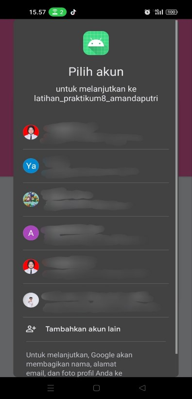
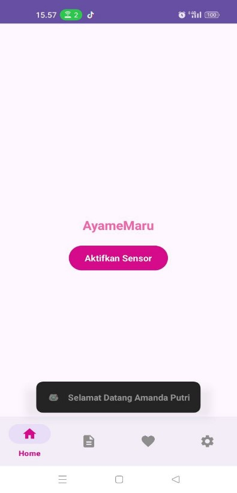
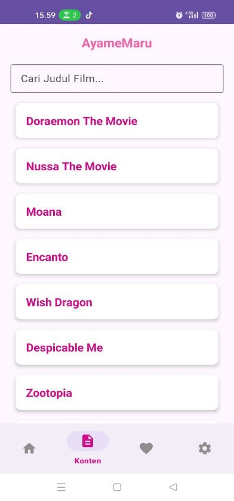
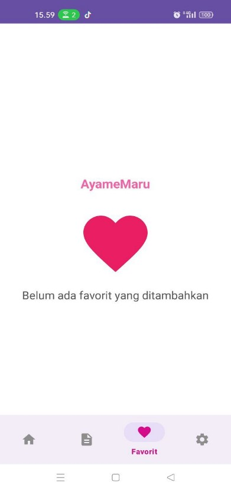
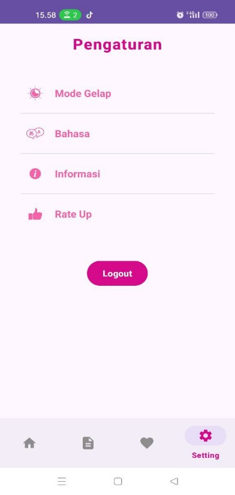

<h1 style="color:#FF69B4;">🎀 AyameMaru 🎀</h1>

<strong>Aplikasi Movie & Sensor Android</strong>

<em>Desain elegan, modern, dan penuh pesona pink 💕</em>

 

  
  
  
  

---

## 🌷 Tentang AyameMaru

**AyameMaru** adalah aplikasi Android yang memadukan fitur daftar film 📽️ dengan sensor getar 📳 dan sistem notifikasi 🔔. Aplikasi ini dibangun menggunakan **Jetpack Compose**, **Firebase**, dan **Kotlin**.

> Dibuat dengan cinta untuk kamu yang ingin belajar membangun aplikasi Android modern ✨

---

## 💖 Fitur Unggulan

| 💡 Fitur           | 💬 Deskripsi                                                                 |
|-------------------|------------------------------------------------------------------------------|
| 🔐 Autentikasi     | Login via Google Sign-In atau Email & Password                              |
| 🏡 Halaman Utama   | Tombol sensor ➜ getar + notifikasi otomatis                                 |
| 🎬 Daftar Film     | Lihat koleksi film favorit kamu 💕                                           |
| ⭐ Favorit         | Tambahkan film ke daftar favorit kamu ✨                                     |
| ⚙️ Pengaturan      | Mode terang/gelap, bahasa, info, & rate app                                 |
| 🚪 Logout          | Tombol logout dengan navigasi lembut ke halaman login                       |

---

## 📸 Tampilan Aplikasi

  
  
  
  
  
  

---

## 🧰 Teknologi yang Digunakan

- 🎨 **Jetpack Compose** – UI modern dan reaktif
- 🔐 **Firebase Auth** – Login cepat dan aman
- 📳 **SensorManager & Vibrator** – Deteksi gerakan & getar
- 🔔 **Android Notification** – Kirim notifikasi otomatis
- ☁️ **OpenWeatherMap API** *(opsional)*

---

## 💌 Catatan Manis

> Aplikasi ini cocok untuk kamu yang ingin belajar:
> - Mengintegrasikan **sensor getar** dan notifikasi
> - Membangun UI dengan **Jetpack Compose**
> - Autentikasi via **Firebase**
> - Navigasi antar halaman yang halus 💫

---

  
  
<strong>🌸 Terima kasih sudah mampir ke AyameMaru! 🌸</strong>

