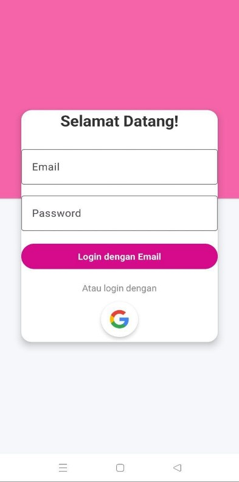

# 🌸 AyameMaru – Movie & Sensor App

Aplikasi film dan sensor getar dengan desain sederhana, responsif, dan modern.

  
  
  
  

---

## 🧾 Tentang AyameMaru

**AyameMaru** adalah aplikasi Android yang dirancang untuk menampilkan daftar film pengguna dengan fitur tambahan seperti sensor getar dan notifikasi. Aplikasi ini memiliki fitur login, mode gelap/terang, halaman pengaturan, dan sistem logout yang efisien. Dibuat menggunakan Android Studio, aplikasi ini cocok digunakan sebagai bahan pembelajaran maupun demonstrasi pengembangan aplikasi mobile.

---

## 🌟 Fitur Unggulan

### 🔐 Autentikasi
- Login menggunakan **Google Sign-In** atau secara manual dengan **email dan password**.

### 🏠 Halaman Utama (Home)
- Terdapat tombol **"Aktifkan Sensor"**.
- Ketika ditekan, perangkat akan **bergetar**.
- Muncul **notifikasi** dari fitur sensor.
- Menggunakan **SensorManager dan Vibrator** Android.

### 🎬 Konten Film
- Menampilkan daftar judul film yang bisa dilihat oleh pengguna.

### ⭐ Halaman Favorit
- Halaman ini berisi tampilan daftar favorit (placeholder).

### ⚙️ Pengaturan
- Pengaturan **mode terang/gelap**.
- Pilihan **bahasa**, informasi aplikasi, dan tombol **rate up**.

### 🚪 Logout
- Terdapat tombol Logout untuk kembali ke halaman login.

---

## 📷 Screenshot

> Berikut adalah tampilan dari aplikasi AyameMaru :

  
  
  
  
  
  

---

## 🛠 Teknologi yang Digunakan
- Android Studio (Kotlin)
- Firebase Authentication
- Sensor & Getar
- Notification 

> AyameMaru dikembangkan sebagai bagian dari pembelajaran membangun aplikasi Android modern.
